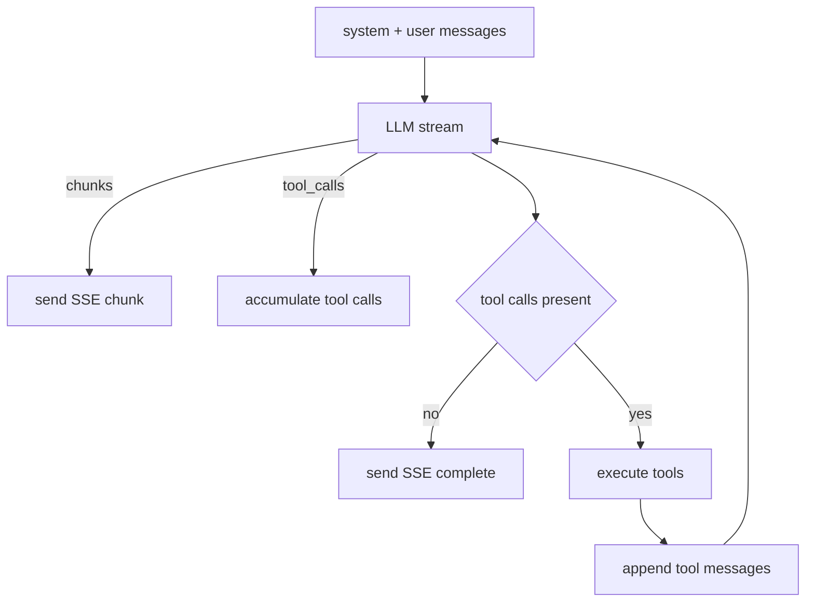

# Chat + tool calling (agentic interface)

FleetPrompt’s `/chat` is intentionally designed as a **command surface**, not “generic chatbot UI.”

Today, Chat proves:
- SSE streaming transport
- an OpenAI-style tool calling loop
- tenant-scoped tool execution

Key files:
- Route + SSE pipeline: [`FleetPromptWeb.Router`](backend/lib/fleet_prompt_web/router.ex:155)
- SSE handler: [`FleetPromptWeb.ChatController.send_message/2`](backend/lib/fleet_prompt_web/controllers/chat_controller.ex:62)
- LLM streaming facade: [`FleetPrompt.LLM.stream_chat_completion/3`](backend/lib/fleet_prompt/llm.ex:135)
- Tool definitions/execution: [`FleetPrompt.AI.Tools`](backend/lib/fleet_prompt/ai/tools.ex:1)
- Tool loop max rounds setting: [`FleetPrompt.Chat.Settings.tool_loop_max_rounds/0`](backend/lib/fleet_prompt/chat/settings.ex:21)

## Transport contract (SSE)

Endpoint: `POST /chat/message` (SSE response)

The client expects SSE events where each `data:` payload is a JSON object.

Current event types sent by the server:
- `start`
- `chunk` (streaming assistant content)
- `tool_calls` (debug event; client ignores unknown types)
- `tool_start` / `tool_result` (debug events)
- `complete` (final message + meta)

Client parser is implemented in [`frontend/src/pages/Chat.svelte`](frontend/src/pages/Chat.svelte:210).

## The tool loop (server-side)

The core loop is implemented in:
- [`FleetPromptWeb.ChatController.run_tool_loop/5`](backend/lib/fleet_prompt_web/controllers/chat_controller.ex:185)
- [`FleetPromptWeb.ChatController.do_run_tool_loop/6`](backend/lib/fleet_prompt_web/controllers/chat_controller.ex:191)

### Algorithm

1. Build `messages = [system, user]`
2. Call LLM streaming with tools provided
3. While streaming:
   - stream assistant text chunks to the client (`chunk`)
   - accumulate tool call deltas until the model completes
4. If there are no tool calls → emit `complete` and finish
5. If there are tool calls → execute them and append `tool` messages
6. Repeat until:
   - the model stops calling tools, or
   - the max rounds limit is hit

## Tool surface (current)

Tools are declared in [`FleetPrompt.AI.Tools.definitions/0`](backend/lib/fleet_prompt/ai/tools.ex:10).

Tools are executed in [`FleetPrompt.AI.Tools.execute/4`](backend/lib/fleet_prompt/ai/tools.ex:105).

### Current capabilities (thin slice)
- list forum categories/threads
- create forum category/thread/post

This matches your observation: tool calls can currently create Categories, Threads, and Posts from prompts.

## Tenant + actor handling

- The chat request runs through `:protected` and has tenant context set by the org selection pipeline.
- The chat controller passes `tenant` and `actor_user_id` into tool execution.

See:
- tenant derived from assigns: [`FleetPromptWeb.ChatController.stream_llm_response/3`](backend/lib/fleet_prompt_web/controllers/chat_controller.ex:112)
- actor derived from assigns: [`FleetPromptWeb.ChatController.stream_llm_response/3`](backend/lib/fleet_prompt_web/controllers/chat_controller.ex:113)

## Safety stance (current)

In [`FleetPromptWeb.ChatController.build_system_prompt/3`](backend/lib/fleet_prompt_web/controllers/chat_controller.ex:150), the system prompt establishes a critical rule:
- only call write tools when the user explicitly asks to create something

This is a good baseline, but it is not sufficient as the platform grows.

## Recommended hardening (next iterations)

### 1) Make mutating tools directive-backed
Current tools mutate tenant state directly (forum create). This bypasses the stronger platform guarantee.

Recommendation:
- tools should request directives (e.g. `forum.thread.create`, `forum.post.create`) and return the directive id
- [`FleetPrompt.Jobs.DirectiveRunner`](backend/lib/fleet_prompt/jobs/directive_runner.ex:1) performs the actual mutation
- tools become “typed intent creators” rather than “direct writers”

### 2) Emit signals for tool-driven writes
Today, forum signals are emitted by the HTTP controller layer.

If chat tools create forum records directly, they should also emit:
- `forum.category.created`
- `forum.thread.created`
- `forum.post.created`

(Or, again, push the write behind directives so the runner emits signals consistently.)

### 3) Tool permissions and role gating
When tools expand beyond the forum, they will need an explicit permission model:
- tool allowed for this user role?
- tool allowed for this package installation?
- tool allowed for this tenant settings profile?

This design is scaffolded in the blueprint docs:
- [`project_blueprints/BLUEPRINT_TOOL.md`](project_blueprints/BLUEPRINT_TOOL.md:1)

### 4) Persist chat transcripts and action trails
The current Chat controller does not persist messages.

As soon as Chat becomes a real product surface, persist:
- user message
- assistant message
- tool calls executed (inputs + outputs)
- directives created
- signals emitted (by correlation id)

This is the bridge that turns “chat” into an audit-friendly operator console.
