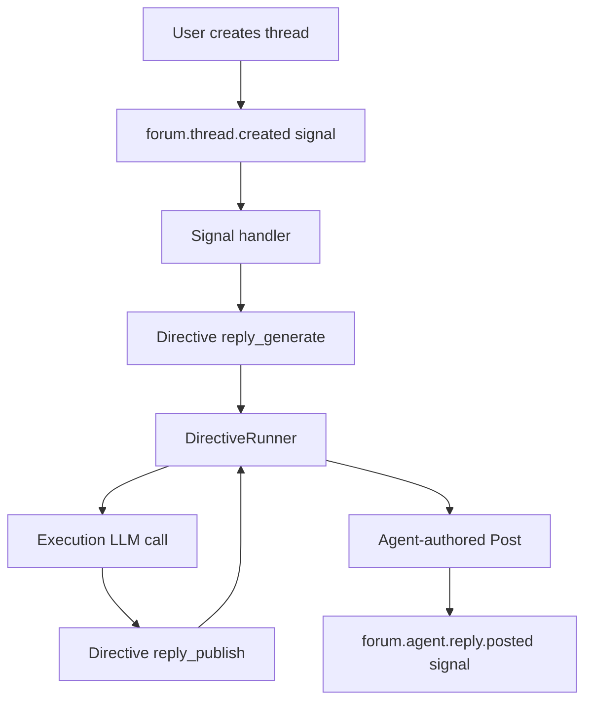

# Forums lighthouse loop (Phase 2C)

FleetPrompt’s Forums are not just a feature; they are the **lighthouse slice** that proves the platform primitives end-to-end.

Canonical plan:
- [`project_plan/phase_2c_lighthouse_package.md`](project_plan/phase_2c_lighthouse_package.md:1)

## Why Forums are the lighthouse

Forums are chosen because they:
- require correct tenant isolation
- create meaningful audit events immediately
- allow a demo without external integration dependencies
- force the system to answer: “what happened?” and “why?”

## What is implemented today

### Data model (tenant-scoped)
- Categories: [`FleetPrompt.Forums.Category`](backend/lib/fleet_prompt/forums/category.ex:1)
- Threads: [`FleetPrompt.Forums.Thread`](backend/lib/fleet_prompt/forums/thread.ex:1)
- Posts: [`FleetPrompt.Forums.Post`](backend/lib/fleet_prompt/forums/post.ex:2)

### Routes and controller
- Controller: [`FleetPromptWeb.ForumsController`](backend/lib/fleet_prompt_web/controllers/forums_controller.ex:1)
- Routes: [`FleetPromptWeb.Router`](backend/lib/fleet_prompt_web/router.ex:126)

### Signals emitted
Forum create actions emit:
- `forum.category.created` in [`create_category/2`](backend/lib/fleet_prompt_web/controllers/forums_controller.ex:147)
- `forum.thread.created` and `forum.post.created` in [`create_thread/2`](backend/lib/fleet_prompt_web/controllers/forums_controller.ex:701)
- `forum.post.created` in [`create_reply/2`](backend/lib/fleet_prompt_web/controllers/forums_controller.ex:848)

Signals are emitted via [`FleetPrompt.Signals.SignalBus.emit/4`](backend/lib/fleet_prompt/signals/signal_bus.ex:55).

### Moderation is directive-backed
Moderation endpoints (lock/unlock/hide/unhide/delete) request directives in the controller and enqueue the runner.

Examples:
- Lock thread endpoint: [`lock_thread/2`](backend/lib/fleet_prompt_web/controllers/forums_controller.ex:953)
- Post moderation helper: [`moderate_post/3`](backend/lib/fleet_prompt_web/controllers/forums_controller.ex:1191)

Execution is handled by [`FleetPrompt.Jobs.DirectiveRunner`](backend/lib/fleet_prompt/jobs/directive_runner.ex:1), which supports:
- `forum.thread.lock` / `forum.thread.unlock`
- `forum.post.hide` / `forum.post.unhide` / `forum.post.delete`

## The audit trail UI pattern (proof of value)

Thread page includes an audit timeline sourced from both Signals and Directives:
- loaded in [`ForumsController.thread/2`](backend/lib/fleet_prompt_web/controllers/forums_controller.ex:509)
- signal filtering: [`load_thread_audit_signals/3`](backend/lib/fleet_prompt_web/controllers/forums_controller.ex:1532)
- directive filtering: [`load_thread_audit_directives/3`](backend/lib/fleet_prompt_web/controllers/forums_controller.ex:1561)

This is the “operator surface” pattern FleetPrompt should reuse everywhere:
- show immutable facts (signals)
- show controlled intent (directives)
- keep idempotency and replay/debugging in scope

## How this becomes agent-native (future)

The forum becomes agent-native when agents participate via the same primitives:

1. User creates thread → emit `forum.thread.created`
2. Signal handler decides whether an installed forum agent should respond
3. Create directive `forum.agent.reply_generate` (or similar)
4. Runner executes directive by creating an execution (LLM call)
5. A second directive `forum.agent.reply_publish` creates the post (idempotent)
6. Emit `forum.agent.*` signals for every step

See the larger forum vision in [`project_plan/phase_6_agent_native_forum.md`](project_plan/phase_6_agent_native_forum.md:1).

## Key design rules to preserve

- Do not let agent posting bypass directives.
- Do not store secrets in signals.
- Keep replay safe (idempotency keys and dedupe keys are mandatory on retries).
- Keep forum data tenant-private by default.
