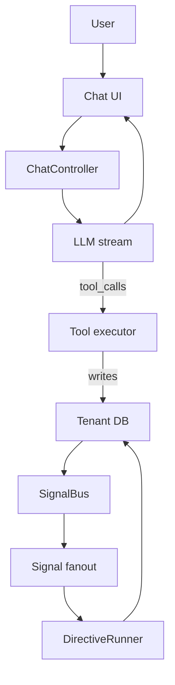

# FleetPrompt mental model

FleetPrompt is a multi-tenant platform for deploying **agentic systems** as **packages** that can be installed into an organization (tenant), executed safely, and audited/replayed.

This file is intentionally short. Deeper details live in:
- [`project_guide/02_SIGNALS_AND_DIRECTIVES.md`](project_guide/02_SIGNALS_AND_DIRECTIVES.md:1)
- [`project_guide/03_PACKAGES_AND_INSTALLATIONS.md`](project_guide/03_PACKAGES_AND_INSTALLATIONS.md:1)
- [`project_guide/04_CHAT_TOOL_CALLING.md`](project_guide/04_CHAT_TOOL_CALLING.md:1)

## The 5 primitives

### 1) Tenant
- Each org gets its own Postgres schema: `org_<slug>`.
- Tenant context is carried via Ash multitenancy, set in the request pipeline and passed to reads/writes.

Router context is built in [`FleetPromptWeb.Router`](backend/lib/fleet_prompt_web/router.ex:1) using [`FleetPromptWeb.Plugs.FetchOrgContext`](backend/lib/fleet_prompt_web/plugs/fetch_org_context.ex:1).

### 2) Package
A package is a versioned unit of value you can install into a tenant.

In v1, packages are *metadata-first*: the platform owns execution logic and packages provision tenant records.

### 3) Signal
A signal is an immutable fact: **what happened**.

Signals are tenant-scoped records stored in `org_<slug>.signals`.

Emit via [`FleetPrompt.Signals.SignalBus.emit/4`](backend/lib/fleet_prompt/signals/signal_bus.ex:55).

### 4) Directive
A directive is controlled intent: **what we want to happen**.

Directives are tenant-scoped records stored in `org_<slug>.directives`.

Execute via [`FleetPrompt.Jobs.DirectiveRunner.perform/1`](backend/lib/fleet_prompt/jobs/directive_runner.ex:37).

### 5) Execution
Execution is the durable record of work performed (LLM calls + tool calls + workflow steps). This exists in code and tests, but is still being hardened into the canonical “run” substrate.

## What FleetPrompt means by agentic

In FleetPrompt, “agentic” does not mean “the model can do anything.” It means:

- natural language can become **typed actions**
- actions are executed through **auditable primitives**
- side effects are **idempotent** and safe to retry
- the system emits durable facts (signals) that can be replayed

## The core loop

Mapping to code:
- Chat SSE + tool loop: [`FleetPromptWeb.ChatController`](backend/lib/fleet_prompt_web/controllers/chat_controller.ex:1)
- Tool definitions/execution: [`FleetPrompt.AI.Tools`](backend/lib/fleet_prompt/ai/tools.ex:1)
- LLM streaming: [`FleetPrompt.LLM`](backend/lib/fleet_prompt/llm.ex:1)
- Signals: [`FleetPrompt.Signals.SignalBus`](backend/lib/fleet_prompt/signals/signal_bus.ex:1)
- Directives runner: [`FleetPrompt.Jobs.DirectiveRunner`](backend/lib/fleet_prompt/jobs/directive_runner.ex:1)

## One sentence summary

FleetPrompt turns “do X” into **typed, tenant-scoped, auditable work**: signals for facts, directives for intent, packages for distribution, and executions/workflows for reliable running.
