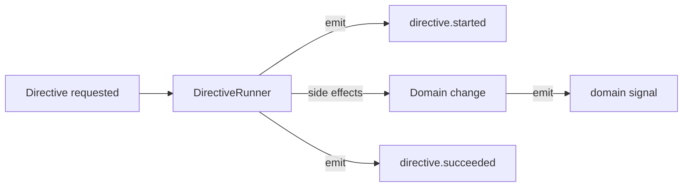

# Signals and Directives (the platform contract)

This guide explains FleetPrompt’s core operability model.

- **Signals** = immutable facts (what happened)
- **Directives** = controlled intent (what should happen)

This is implemented today (tenant-scoped) in:
- [`FleetPrompt.Signals.Signal`](backend/lib/fleet_prompt/signals/signal.ex:1)
- [`FleetPrompt.Directives.Directive`](backend/lib/fleet_prompt/directives/directive.ex:1)

The canonical spec is in [`project_plan/phase_2b_signals_and_directives.md`](project_plan/phase_2b_signals_and_directives.md:1).

## Why this exists

Agentic systems fail in production when they lack:
- auditability (what happened)
- explicit intent (what are we trying to do)
- retry safety (idempotency)
- replay/debugging

FleetPrompt bakes these in by making Signals and Directives first-class tenant data.

## Signal contract

### Storage
Signals are tenant-scoped rows in `org_<slug>.signals` via [`FleetPrompt.Signals.Signal`](backend/lib/fleet_prompt/signals/signal.ex:1).

### Emission (single entrypoint)
All signal emission should go through [`FleetPrompt.Signals.SignalBus.emit/4`](backend/lib/fleet_prompt/signals/signal_bus.ex:55).

### Minimal required fields
- `name` (string): dot-delimited taxonomy
- `payload` (map): JSON-safe
- `occurred_at` (datetime)

Recommended fields (for operability)
- `dedupe_key`
- `source`
- `actor_type` + `actor_id`
- `subject_type` + `subject_id`
- `correlation_id` + `causation_id`

### Naming conventions
- lower-case, dot-delimited domain namespaces
- no versions embedded in the name (versions go in payload)

Examples:
- `package.install.requested`
- `directive.started`
- `forum.thread.created`

The name validation rule is enforced in [`FleetPrompt.Signals.Signal` create action](backend/lib/fleet_prompt/signals/signal.ex:152).

### Idempotency (dedupe_key)
If a signal may be emitted more than once due to:
- retries
- polling
- webhook redelivery
- job retries

…then set a stable `dedupe_key`.

`dedupe_key` uniqueness is enforced in [`FleetPrompt.Signals.Signal` identities](backend/lib/fleet_prompt/signals/signal.ex:118).

### Fanout
Signal fanout is intentionally optional in the MVP.

The bus enqueues jobs when available in [`FleetPrompt.Signals.SignalBus.maybe_enqueue_fanout/4`](backend/lib/fleet_prompt/signals/signal_bus.ex:200).

## Directive contract

### Storage
Directives are tenant-scoped rows in `org_<slug>.directives` via [`FleetPrompt.Directives.Directive`](backend/lib/fleet_prompt/directives/directive.ex:1).

### Lifecycle
- `requested` (default)
- `running`
- `succeeded`
- `failed`
- `canceled`

Lifecycle actions exist as explicit updates in [`FleetPrompt.Directives.Directive` actions](backend/lib/fleet_prompt/directives/directive.ex:150).

### Idempotency (idempotency_key)
If the directive can be requested multiple times (double-clicks, retries), set a stable `idempotency_key`.

Uniqueness is enforced by identity in [`FleetPrompt.Directives.Directive` identities](backend/lib/fleet_prompt/directives/directive.ex:141).

### Execution (DirectiveRunner)
Directives are executed by the Oban worker [`FleetPrompt.Jobs.DirectiveRunner.perform/1`](backend/lib/fleet_prompt/jobs/directive_runner.ex:37).

Key operational guardrails already implemented:
- scheduled snooze: [`ensure_due/1`](backend/lib/fleet_prompt/jobs/directive_runner.ex:97)
- terminal-state discard (rerun requires explicit flag): [`ensure_runnable/2`](backend/lib/fleet_prompt/jobs/directive_runner.ex:115)
- emits lifecycle signals best-effort: [`emit_lifecycle_signal_maybe/4`](backend/lib/fleet_prompt/jobs/directive_runner.ex:955)

## How they compose

### Design rule: where to emit
- Emit **signals** at the *system boundaries*:
  - HTTP controller request accepted
  - background job started/finished
  - integration webhook ingested
- Use **directives** for any operation that:
  - can be retried
  - can cause external side effects
  - needs auditability
  - requires role gating

## Current state vs target state

### Current (as-built)
- Directives already govern: package installs, forum moderation.
- Some chat tools perform direct writes (forum create) via [`FleetPrompt.AI.Tools.execute/4`](backend/lib/fleet_prompt/ai/tools.ex:105).

### Target (recommended)
- Mutating chat tools should request directives instead of writing directly.
- Directives should be the only “writer” for:
  - moderation
  - agent-authored posts
  - package lifecycle
  - outbound integration actions

## What to standardize next

1. A consistent `subject_type` taxonomy:
   - `forum.thread`, `forum.post`, `package.installation`, etc.
2. A consistent correlation scheme:
   - `correlation_id` per user request / conversation / external event
3. A dedupe scheme cookbook per domain:
   - forum creates vs edits vs moderation
   - installs vs upgrades

These are discussed in roadmap form in [`project_plan/phase_2b_signals_and_directives.md`](project_plan/phase_2b_signals_and_directives.md:247).
