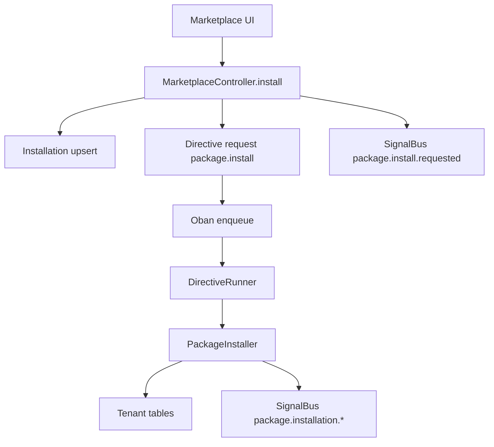

# Packages and Installations (distribution + provisioning)

This guide describes how FleetPrompt packages work **as a platform primitive**.

- **Package**: global registry record (public schema)
- ** understood as “metadata-only in v1”**: packages do not ship arbitrary executable code into FleetPrompt
- **Installation**: tenant record that tracks lifecycle and config in `org_<slug>`
- **Directive-driven install**: installs are requested via `package.install` directives and executed by the runner

Relevant plan docs:
- [`project_plan/phase_2_package_marketplace.md`](project_plan/phase_2_package_marketplace.md:1)
- [`project_plan/phase_2b_signals_and_directives.md`](project_plan/phase_2b_signals_and_directives.md:1)

## Data model (as-built)

### Package registry
Global record: [`FleetPrompt.Packages.Package`](backend/lib/fleet_prompt/packages/package.ex:1)

Key fields:
- `slug` + `version` identify the package
- `includes` describes what the package provisions (agents/workflows/skills/tools)
- `is_published` controls install availability

### Installation
Tenant record: [`FleetPrompt.Packages.Installation`](backend/lib/fleet_prompt/packages/installation.ex:1)

Key fields:
- `package_slug` + `package_version`
- lifecycle `status`: `requested | installing | installed | failed | disabled`
- `config` for package-defined configuration
- `idempotency_key` to tie installs to directives/retries

## Install flow (today)

HTTP boundary: [`FleetPromptWeb.MarketplaceController.install/2`](backend/lib/fleet_prompt_web/controllers/marketplace_controller.ex:213)

### Flow
1. Validate session + org + tenant context
2. Load package from registry
3. Create or reuse tenant Installation (by slug)
4. Create or reuse `package.install` Directive (by idempotency key)
5. Emit `package.install.requested` Signal (best-effort)
6. Enqueue [`FleetPrompt.Jobs.DirectiveRunner`](backend/lib/fleet_prompt/jobs/directive_runner.ex:1)
7. Runner executes `package.install` and enqueues [`FleetPrompt.Jobs.PackageInstaller`](backend/lib/fleet_prompt/jobs/package_installer.ex:1)
8. Installer provisions tenant content (currently: agents) and marks installation installed/failed

## PackageInstaller semantics

Worker: [`FleetPrompt.Jobs.PackageInstaller.perform/1`](backend/lib/fleet_prompt/jobs/package_installer.ex:34)

What it does today:
- loads the tenant Installation
- marks it `installing`
- loads the registry package
- installs included agents (best-effort idempotency by name+system_prompt)
- marks installation `installed` or `failed`
- emits install lifecycle signals best-effort
- tries to mark the matching directive succeeded/failed if an `idempotency_key` exists

Where directive linkage happens:
- directive lookup: [`load_directive_for_installation/2`](backend/lib/fleet_prompt/jobs/package_installer.ex:514)

## “Metadata-only” stance and why it matters

FleetPrompt intentionally avoids “3rd-party code runs in our process” in v1.

Packages are still powerful because they can:
- provision tenant records (agents, templates, configuration)
- declare which signals they consume and which directives they may request (future)

This stance is defined in the Phase 2B spec: [`project_plan/phase_2b_signals_and_directives.md`](project_plan/phase_2b_signals_and_directives.md:103).

## Design implications for future skills/workflows

- Treat package installation as **provisioning + wiring**, not arbitrary runtime execution.
- Prefer “platform-owned handlers” referenced by package metadata.
- Keep installs deterministic:
  - idempotency keys
  - stable dedupe keys in signals
  - a clear audit trail per installation

## Operational checklist for new package types

When introducing new kinds of package content (workflows, skills, integrations):

- Add installation provenance (what did this package create?)
- Define uninstall/upgrade semantics
- Emit signals for lifecycle and per-resource provisioning
- Ensure that retries do not duplicate provisioning

Uninstall path exists via [`FleetPromptWeb.MarketplaceController.uninstall/2`](backend/lib/fleet_prompt_web/controllers/marketplace_controller.ex:386) and runner support in [`FleetPrompt.Jobs.DirectiveRunner`](backend/lib/fleet_prompt/jobs/directive_runner.ex:319).
